# Diamond and Modelsim for Verilog simulation

## Demo files

This demo includes a pwm generator and its corresponding testbench. The pwm generator generates a pwm signal whose properties are controlled via a 2-bit select input, resulting in four possible pwm configurations. The pulse widths are hardcoded as parameters in the Verilog source code. An enable signal also controls the output of the generator. When *en* is asserted the generator outputs the selected pwm signal, otherwise the output is low.

Demo files:

- [pwm.v](./pwm.v) - Source code for pwm generator.
- [tb_pwm.v](./tb_pwm.v) - Source code for testbench.

## Creating a project
1. From the *File* menu, select *New*->*Project*. Click next until you are prompted for the *Project Name* and associated work directories. Fill the fields accordingly and click next.

2. Once prompted for source files, you may include Verilog files in this tutorial or choose to include them later. Click next.

3. Choose the appropriate target device. In our example, we will use the MachXO3LF starter kit. Click next after setting the appropriate fields.
    - Family: MachXO3LF
    - Device: LCM03LF-6900C
    - Performance Grade: 6
    - Package Type: CABGA256
    - Operating conditions: Industrial
 
4. For Synthesis Tool, select Lattice LSE. Click next.

5. You will be prompted with a summary of the project settings. Click finish to create the project.

## Adding Source Files

1. If you have not added the source files earlier, go to the *File List* tab on the left sidebar. Right-click on the *Input Files* selection and select *Add*->*Existing file* in the dropdown menu. Alternatively, you can create new source Verilog files via *Add*->*New File*.

    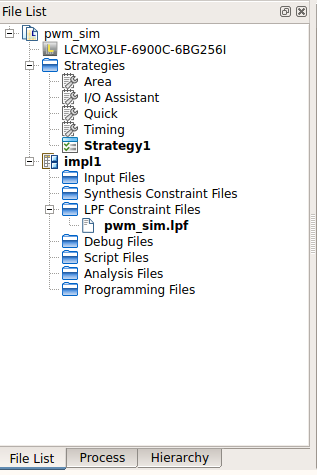

2. For now, just add *pwm.v*. Your file list should now look something like the one shown below.

    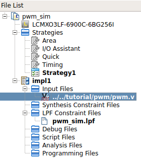

3. Adding files to the project automatically invokes the tool's parser to check for errors in the files. This would show in the *Output* console tab at the bottom of the default view, as shown below.

    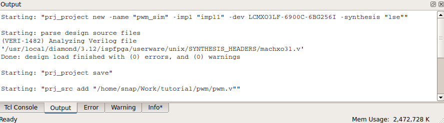

4. When modifying existing input files, from the *Design* menu select *Refresh Design* to force the tool to invoke the parser again to check for any errors after modification.

5. The *Hierarchy* tab in the left sidebar should show the modules in the design in its appropriate hierarchy tree. Since our example uses only a single module, it will show only a single module.

6. To synthesize the design, go to the *Process* tab in the left sidebar. This tab shows all processes that can be done to the design, which includes synthesis, mapping to FPGA gates/resources, and programming file (bitstream) generation. Double-click on the *Synthesize Design* option to begin synthesis. The *Output* console should show the processes executed during synthesis. Once synthesis completes, a check mark should appear in the *Synthesize Design* option similar to the one shown below.

    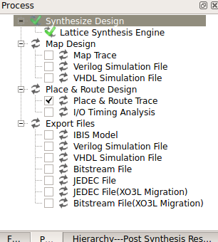

7. We can view the schematic of the synthesized design by going to the *Hierarchy* tab and right-clicking on the topmost module in the hierarchy tree. Select *Goto RTL Definition*. This should invoke the *Netlist Analyzer* in the main window, similar to the following:

    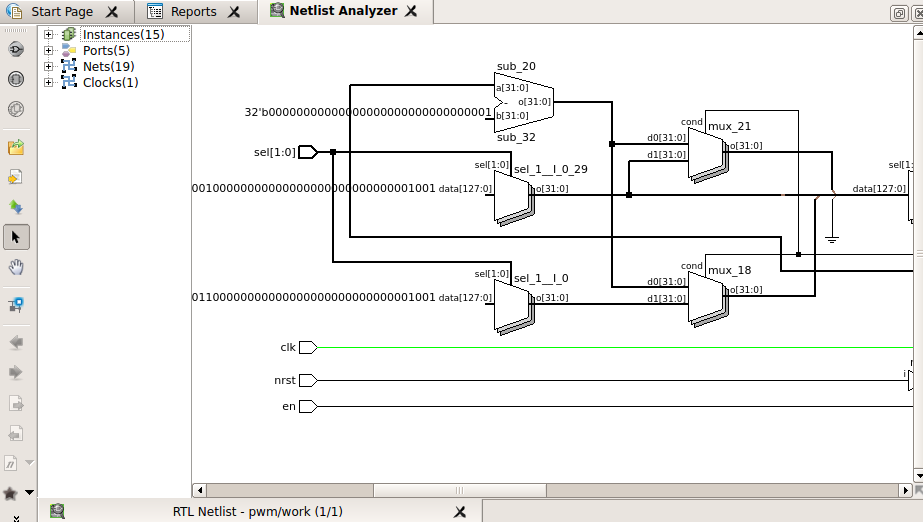

## Running a testbench simulation

1. To run a simulation, we must first add the testbench source to the project. Add the *tb_pwm.v* file. If you go to the *Hierarchy* tab, the hierarchy should show the *tb_pwm* module having an instance of the *pwm* module, similar to the one shown below.

    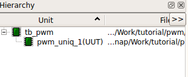

2. If you try to Synthesize the design, it would result in an error since the testbench has no ports. When synthesizing, always make sure that the top-level module is set to a module that is not a testbench. In our example, you can set the *pwm* module as the top-level module by going to the *Hierarchy* tab, right-clicking on the *pwm* module, and then selecting *Set as Top-Level Unit*.

3. To run the simulation, select *Simulation Wizard* in the *Tools* menu. Click next. You will be prompted for a simulator project name and location. Fill these in accordingly and click next.

4. Select *RTL* in the *Process Stage* and click next.

5. You will then be prompted to add and reorder source files. All input files from the file list are automatically added. Make sure that the file containing the testbench module is at the bottom of the list. Click next.

6. The *Simulation Wizard* should now parse the files and should confirm the top-level module, which is the testbench. Click next.

    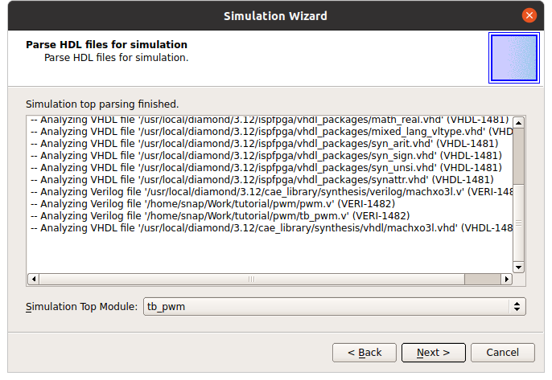

7. A summary window will now be shown. Make sure that the following options are checked and click finish to invoke the simulator.
    - Run simulator
    - Add-top-level signals to waveform display
    - Run simulation

8. ModelSim Lattice FPGA Edition should now be opened, along with the waveform display showing the results of the simulation. The *sim* tab on the leftmost sidebar shows the hierarchy of modules in the simulation. The *Objects* pane shows the signals and parameters in the currently selected module instance in the hierarchy. The *Wave* window shows the timing diagram or waveform of the simulation.

    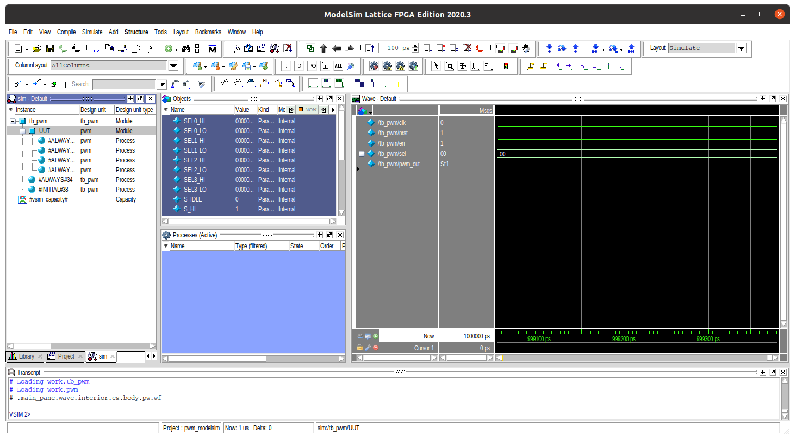

9. The *Wave* window shows only the signals in the testbench module by default. You may zoom in/out by right-clicking on the waveform and selecting the appropriate option. The image below shows the waveform after using zoom full. You can also pan by using the sliders on the bottom and the side.

    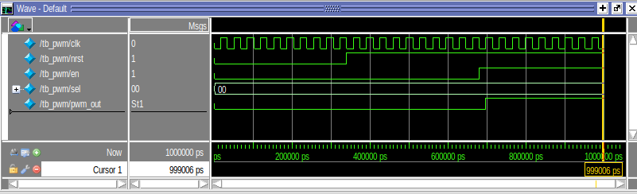

10. To run the simulation further, click the *run* button shown below. The simulation is extended by the time specified in the *Run length* box. You may change this value to your preferred run length. You may also run the simulation by selecting the menu *Simulate*->*Run*.

    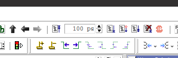

11. The image below shows the simulation after being run for an additional 10000ns and zoomed full.

    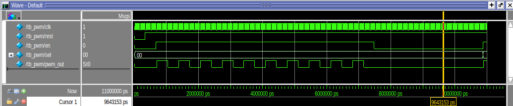

12. We can probe additional signals, particularly those within instances inside the module we are testing. Simply descend to the module containing the signal in the *sim* tab hierarchy, then select the appropriate signal in the *Objects* pane, right-click on it and select *Add Wave*. Add the *ctr* and *state* signals within the instance *UUT* (module *pwm*) to the wave view as shown.

    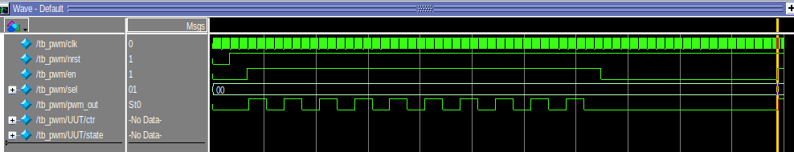

13. You will notice that there is no data for the newly added signals in the wave view. You will need to restart the simulation. Simply click on the *restart* button and run the simulation as you did in step 10. You may also do this via the menu *Simulate*->*Restart*.

14. You may change the radix or number representation of vectors in the wave view by right-clicking on the signal and selecting *Radix*->(appropriate radix). The image below shows the *ctr* signal represented as unsigned integers.

    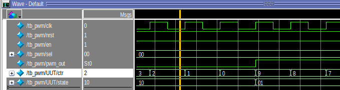
